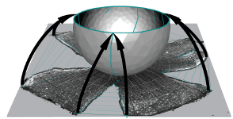

# Retistruct

{: style="float: right"} _Computational reconstruction and transformation of flattened retinae_

Retistruct is an <a href="http://www.r-project.org">R</a> package to
morph a flat surface with cuts (a dissected flat-mount retina) onto a
curvilinear surface (a standard retinal shape).  It can estimate
the position of a point on the intact adult retina to within 8&deg; of
arc (3.6% of nasotemporal axis). The coordinates in reconstructed
retinae can be transformed to visuotopic coordinates.

## How Retistruct works

{: style="float: right"}

Reconstruction is achieved by: stitching the marked-up cuts of the
flat-mount outline; dividing the stitched outline into a mesh whose
vertices then are mapped onto a curtailed sphere; and finally moving
the vertices so as to minimise a physically-inspired deformation
energy function.

* Full details are in the paper: Sterratt, D. C., Lyngholm, D.,
  Willshaw, D. J. and Thompson, I. D. (2013).  Standard Anatomical and
  Visual Space for the Mouse Retina: Computational Reconstruction and
  Transformation of Flattened Retinae with the Retistruct Package. <a
  href="http://www.ploscompbiol.org/article/info%3Adoi%2F10.1371%2Fjournal.pcbi.1002921"><em>PLoS
  Computational Biology</em> 9:e1002921</a>.
* <a href="2012-09-neuroinf.pdf">This poster</a> and <a
  href="http://www.youtube.com/watch?v=LpuqXo8NEOo">this YouTube
  video</a>, presented at the 2012 Neuroinformatics Meeting in Munich,
  has more details and examples of reconstructions and projections
  into visual space.

## Installation and documentation

Retistruct has been tested on GNU/Linux, Mac OS X and Microsoft
Windows.

### Stable version

To install the
[stable version of Retistruct hosted on CRAN](https://cran.r-project.org/package=retistruct),
follow the instructions in the
[User Guide](retistruct-user-guide.pdf). The installation contains a
number of demonstration retinae, and instructions for how to handle
retinal flat-mount images in Retistruct.

### Development version and source code

The development version of Retistruct contains the most recent bug
fixes and improvements, but may not be stable. To install it follow the instructions on the Retistruct [Github](https://github.com/davidcsterratt/retistruct) repository, where the source code can also be checked out.

### Reference publication

For reference purposes, this [zip file](retistruct_0.5.7.zip) contains
the version of Retistruct that generated the reconstructions in
Sterratt &amp; al. (2013; <a
href="http://www.ploscompbiol.org/article/info%3Adoi%2F10.1371%2Fjournal.pcbi.1002921"><em>PLoS
Computational Biology</em> 9</a>). The file also contains some Matlab
code to read data directories contained by Retistruct.

## Sample data

As well as the built-in demo data, there are some sample images to
practise on:
1. Beginner: [SMI-32 stained retina](data/image.png). As described in
  the [User Guide](retistruct-user-guide.pdf), the outline can be
  marked up in [ImageJ](http://rsb.info.nih.gov/ij/) and
  imported into Retistruct.
2. More advanced: TIFF files (<a
  href="data/left-5x-small.tif">left</a> and <a
  href="data/right-5x-small.tif">right</a>), each containing a stack
  of three images corresponding to Figure 6 of the manuscript: retinae
  labelled with Fluoro-Emerald, Fluoro-Ruby and a brightfield
  image. As described in the <a href="retistruct-user-guide.pdf">User
  Guide</a>, use <a href="http://rsb.info.nih.gov/ij/">ImageJ</a> to
  mark up the outline on the brightfield image, and then use <a
  href="http://rsb.info.nih.gov/ij/">ImageJ's</a> particle analyser to
  find the locations of the stained cells.

## Problems?

If you encounter issues using Retistruct please either:
* <a href="https://github.com/davidcsterratt/retistruct/issues">Report
  a bug on Github</a>
* <a href="mailto:david.c.sterratt@ed.ac.uk">Email David Sterratt</a>

## Work using Retistruct

* Gupta D., Młynarski W., Sumser A., Symonova O., Svatoň J., and Joesch M. (2023). "Panoramic visual statistics shape retina-wide organization of receptive fields". *Nat. Neurosci.*  __26__:&nbsp;606–614 [DOI:10.1038/s41593-023-01280-0]( https://doi.org/10.1038/s41593-023-01280-0)
* D'Souza, S. P., Swygart, D. I., Wienbar, S. R., Upton, B. A., Zhang, K. X., Mackin, R. D., Casasent, A. K., Samuel, M. A., Schwartz, G. W. and Lang, R. A. (2022). "Retinal patterns and the cellular repertoire of neuropsin (Opn5) retinal ganglion cells". *J. Comp. Neurol.* __530__:&nbsp;1247-1262. [DOI: 10.1002/cne.25272](https://doi.org/10.1002/cne.25272)
* Tosetto, L., Williamson, J. E., White, T. E. and Hart, N. S. (2021) "Can the Dynamic Colouration and Patterning
of Bluelined Goatfish (Mullidae; _Upeneichthyslineatus_) Be Perceived by Conspecifics?". *Brain Behav. Evol.* [DOI: 10.1159/000519894](http://dx.doi.org/10.1159/000519894)
* Adelman, S. A., Oikawa, K., Senthilkumar, G., Trane, R. M., Teixeira, L.,  and McLellan, G. J. (2021). "Mapping retinal ganglion cell somas in a large-eyed glaucoma model". *Mol. Vis.* __27__:&nbsp;608–621. [PMC](https://www.ncbi.nlm.nih.gov/pmc/articles/PMC8645189/)
* Nadal-Nicolás, F. M., Kunze, V. P., Ball, J. M, Peng,  B. T., Krishnan, A., Zhou, G., Dong, L. and Li, W. (2020). "True S-cones are concentrated in the ventral mouse retina and wired for color detection in the upper visual field". *eLife* __9__:&nbsp;e56840 [DOI: 10.7554/eLife.56840](http://dx.doi.org/10.7554/eLife.56840)
* Deichler, A., Carrasco, D., Lopez-Jury, L. et al. (2020). "A specialized reciprocal connectivity suggests a link between the mechanisms by which the superior colliculus and parabigeminal nucleus produce defensive behaviors in rodents". *Sci. Rep.* __10__:&nbsp;16220  [DOI: 10.1038/s41598-020-72848-0](https://doi.org/10.1038/s41598-020-72848-0)
* Lyngholm, D., Sterratt, D. C., Hjorth, J. J., Willshaw, D. J., Eglen, S. J., and Thompson, I. D. (2019). "Measuring and Modelling the Emergence of Order in the Mouse Retinocollicular Projection". *bioRxiv*: 713628. [DOI: 10.1101/713628](https://doi.org/10.1101/713628)
* Sondereker, K. B., Stabio, M. E., Jamil, J. R., Tarchick, M. J. and Renna, J. M. (2018) "Where You Cut Matters: A Dissection and Analysis Guide for the Spatial Orientation of the Mouse Retina from Ocular Landmarks". *J Vis. Exp.*  __138__ [DOI: 10.3791/57861](http://dx.doi.org/10.3791/57861)
* Stabio, M. E., Sondereker K. B., Haghgou S. D., Day, B. L., Chidsey, B., Sabbah, S. and Renna, J. M. (2018) "A novel map of the mouse eye for orienting retinal topography in anatomical space". 
*J. Comp. Neurol.* __526__:1749-1759. [DOI: 10.1002/cne.24446](http://dx.doi.org/10.1002/cne.24446)
* Smodlaka, H., Khamas, W. A., Palmer, L., Lui, B.,
  Borovac, J. A., Cohn, B. A. and Schmitz, L. (2016) "Eye Histology
  and Ganglion Cell Topography of Northern Elephant Seals (Mirounga
  angustirostris)" <em>Anat. Rec.  (Hoboken)</em>
  __6__:&nbsp;798-805. <a
  href="http://dx.doi.org/10.1002/ar.23342">DOI: 10.1002/ar.23342</a>
* Cohn, B. A., Collin, S. P., Wainwright, P. C. and Schmitz,
  L. (2015) "Retinal topography maps in R: new tools for the analysis
  and visualization of spatial retinal data". <em>J. Vis.</em>
  __15__:&nbsp;19. <a
  href="http://dx.doi.org/10.1167/15.9.19">DOI:
  10.1167/15.9.19</a>
* Flinn, J. M., Kakalec P., Tappero, R.,
  Jones, B. and Lengyel, I. (2014) "Correlations in distribution and
  concentration of calcium, copper and iron with zinc in isolated
  extracellular deposits associated with age-related macular
  degeneration". <em>Metallomics</em>
  __6__:&nbsp;1223-1228. <a
  href="http://dx.doi.org/10.1039/c4mt00058g">DOI:
  10.1039/c4mt00058g</a>
* Bleckert, A., Schwartz, G. W., Turner, M.H., Rieke, F. and Wong,
  R. O. L. (2014) "Visual space is represented by nonmatching
  topographies of distinct mouse retinal ganglion cell
  types". <em>Current Biology</em> __24__:&nbsp;310-315.
  <a href="http://dx.doi.org/10.1016/j.cub.2013.12.020">DOI:
  10.1016/j.cub.2013.12.020</a>

## Updates

August 2020
: The development branch, 0.7.x, is released. This adds the ability to
stitch together separate fragments and reconstruct 3D data comprising
an overhead image and depth map. There are also user interface
improvements, most notably a magnifier function. The improvements were
supported by an NIH R21 grant (EY027894) from 2018-2020 to Dr. Mark P.
Krebs, The Jackson Laboratory.

December 2019
: Retistruct 0.6.1 and 0.6.2 is out. This reinstates sphericalplots and the saving of reconstructed data. New features include allowing resizing of windows so plots can be larger, allowing data counts to be read in using ijroi and csv formats and exposing some features in the API. Version 0.6.2 fixes a small issue and adds much better documentation for developers.  See the [NEWS file](https://github.com/davidcsterratt/retistruct/blob/master/pkg/retistruct/NEWS)
for more information.

July 2019
: Retistruct 0.6.0 is out. The big change in this version is a
complete refactor of the code, which should enable future enhancements
to happen more quickly. The stitching algorithm is improved. There are
major improvements in image rendering, which should be a lot faster
thanks to the tsearch algorithm in 0.4.x of the geometry package, and
able to deal with high-resolution images.

July 2017
: Retistruct 0.5.11 is out. The CSV input format can now take a file of counts (or "grouped") data and there are a number of bug fixes; see the [NEWS file](https://github.com/davidcsterratt/retistruct/blob/master/pkg/retistruct/NEWS) for more information.

March 2015
:  [Brian Cohn](https://www.linkedin.com/profile/view?id=ADEAAApksKkBd9EgawB_-ysAEyLjdBeLVfT7jSU&authType=OPENLINK&authToken=cUTs&locale=en_US&srchid=1073122861452092899387&srchindex=1&srchtotal=30&trk=vsrp_people_res_name&trkInfo=VSRPsearchId%3A1073122861452092899387%2CVSRPtargetId%3A174370985%2CVSRPcmpt%3Aprimary%2CVSRPnm%3Atrue%2CauthType%3AOPENLINK) has pointed out a precursor paper to Retistruct, which we
  weren't aware of when developing Retistruct, or writing the paper:
  * Curcio, C.A., Sloan, K. R. and Meyers, D. (1989) "Computer methods for
    sampling, reconstruction, display and analysis of retinal whole
    mounts". _Vision Res._ 29(5):529-40. [Pubmed](http://www.ncbi.nlm.nih.gov/pubmed/2603390)
    
## Authors and funding

Retistruct was written by <a
href="http://homepages.inf.ed.ac.uk/sterratt/">David Sterratt</a> at
the <a href="http://www.ed.ac.uk/">University of Edinburgh</a>, and
tested by Daniel Lyngholm and Ian Thompson at the <a
href="http://www.kcl.ac.uk/depsta/biomedical/mrc/">MRC Centre for
Developmental Neurobiology, KCL</a>.

The development of the initial version of Retistruct was supported by
a Programme Grant from the UK <a
href="http://www.wellcome.ac.uk">Wellcome Trust</a> (G083305) from
2008-2013.

Improvements to image handing and refactoring the code (released in
v0.6.0) were supported by The Jackson Laboratory (Bar Harbor, ME, USA)
Scientific Services Innovation Fund from 2016-2017 and an NIH R21
grant (EY027894) from 2018-2020 to Dr. Mark P. Krebs, The Jackson
Laboratory.

The capabilities to reconstruct tissue comprised of separate fragments
(released in v0.7.0) and to reconstruct 3D data comprising an overhead
image and depth map (released in v0.7.2), and user interface
improvements (released in v0.7.0) were supported by an NIH R21 grant
(EY027894) from 2018-2020 to Dr. Mark P. Krebs, The Jackson
Laboratory.

<!--  LocalWords:  Retistruct retistruct Sterratt Willshaw Blog blog
 -->
<!--  LocalWords:  ul li href prepend baseurl endfor rss png Lyngholm
 -->
<!--  LocalWords:  curvilinear visuotopic PLoS neuroinf pdf GTK CRAN
 -->
<!--  LocalWords:  Github al SMI ImageJ Fluoro brightfield ImageJ's
 -->
<!--  LocalWords:  Sondereker Stabio Jamil Tarchick Renna Vis DOI Lui
 -->
<!--  LocalWords:  Haghgou Chidsey Sabbah Neurol Smodlaka Khamas Cohn
 -->
<!--  LocalWords:  Borovac Schmitz Mirounga angustirostris Anat nbsp
 -->
<!--  LocalWords:  Hoboken visualization Flinn Kakalec Tappero Rieke
 -->
<!--  LocalWords:  Lengyel macular Metallomics Bleckert nonmatching
 -->
<!--  LocalWords:  EY sphericalplots ijroi csv tsearch Curcio Pubmed
 -->
<!--  LocalWords:  MRC KCL Wellcome Harbor ynarski Sumser Symonova
<!--  LocalWords:  Svatoň
 -->
 -->
